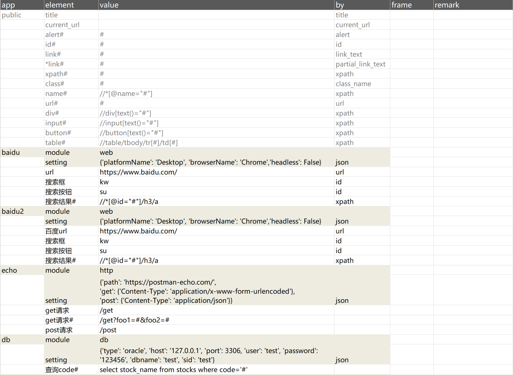
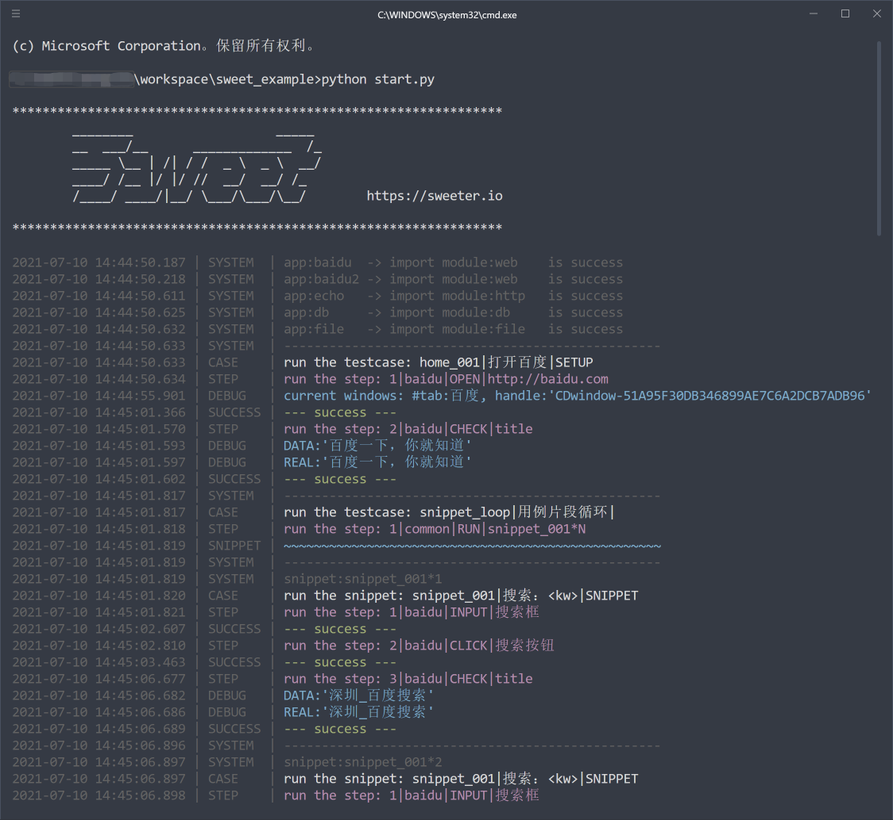

# Sweet

## Sweet 介绍

Sweet 是 Sweetest 的升级版，实现了如下优化：

1. 优化、统一和简化书写格式，用例编写将更加简洁
2. 支持通过 api 接口启动
3. 支持自定义关键字模块，提供统一的开发规范及示例
4. 支持多端测试，可同时启动多个浏览器、App
5. 支持多份测试套件并行执行
6. 更新 logo
7. 删减 Excel格式、JUnit格式的测试报告
8. 优化了Web版测试报告

Sweet 的愿景是构建一个寂静生长的测试生态，优势如下：

1. 提炼了核心功能：减少框架开发工作量，让核心功能高度稳定
2. 关键字实现模块化：关键字和核心功能高度解耦，关键字模块可按需安装和加载
3. 关键字模块实现标准化：第三方开发可以很简单的开发和发布自己的关键字模块
4. 提供接口调用：支持第三方开发 web 管理系统
5. 格式优化：测试用例、元素列表、测试数据合并在一张表格，方便编写和分享
6. 并发执行：提高了执行效率
7. 多端执行：满足不同场景需求

- 测试用例示例

    

- 元素列表示例

    


## 一、使用说明

### 1. 安装及配置

#### 系统要求

1. Windows 10/Windows Server 2016
2. Python 3.9 (*必须)


#### 安装 sweet

安装 sweet

```
pip install sweet
```

#### 按需安装官方`关键字模块`

```
pip install sweet.web
pip install sweet.http
pip install sweet.mobile
pip install sweet.db
pip install sweet.file
```
> 备注：示例的测试用例有用到，请全部安装，后续可自行卸载

#### 更新 sweet (如果需要的话)

```
pip install -U sweet
```

更新官方`关键字模块`

```
pip install -U sweet.web
......
```

### 2. 启动 Web「测试报告」服务

#### 下载示例项目

授权用户请下载

https://github.com/sweeterio/sweet_example

体验版请下载

https://github.com/sweeterio/test_example

#### 启动 Web「测试报告」服务

在项目目录（sweet_example），用命令行执行如下命令：

```
python app.py
```

打开网页：http://127.0.0.1:80 查看测试报告


### 3. 执行自动化测试示例

在项目目录下（sweet_example），用命令行执行如下命令：

```
python start.py
```

 

## 二、与 Sweetest 不同之处

### 1. 用例组织结构

Sweet 改进了用例组织结构

```shell
sweet_example            # Sweet 自动化测试工作目录
├─log                    # 执行日志目录
│  ├─xxx测试计划         # 测试计划日志目录
│  └─...
├─report                 # 测试报告目录
│  └─xxx测试计划
├─xxx测试计划            # 测试计划目录，由用户编写，1个或多个测试套件组成一个测试计划
│  ├─baidu.xlsx          # 测试套件：baidu，其中包含了用例、元素列表（包含启动配置）、测试数据
│  └─echo.xlsx           # 测试套件：echo
├─app.py                 # 测试报告 Web 服务启动脚本
└─start.py               # 用例执行启动脚本
```

### 2. 用例格式

在 Sweet 中，用例、元素列表和测试数据写在一个 Excel 表格中，这个表格是一个完整的测试套件，请参见示例 echo.xlsx

1. elements 如下：

| app  | element | value                                 | by | frame |
|------|---------|---------------------------------------|----|-------|
| echo | module  | http                                  |    |       |
|      | setting | {'path': 'https://postman-echo.com/'} |json|       |
|      | get请求 | /get                                  |    |       |
|      | get请求#| /get?foo1=#&foo2=#                    |    |       |

- 在 Sweet 中，我们支持同时测试多个接口或开启多个浏览器，这些对象我们统称为 app，在此表中 app 列就是对应的（自定义）名称，比如测试 postman-echo.com 接口，可以起名 echo。
- 每个 app 都要有1个 module 属性，其值应该为关键字模块名，如：http，web，db等定义在sweet\modules 目录下的模块。
- 每个 app 可以有0个或1个 setting 属性，定义该模块的全局属性或启动属性，可以参见 baidu.xlsx。该属性值的格式必须为字典，且其 by 值为 json。

2. 测试用例如下：

| id  | title | condition | step | keyword | app | element | data | expected |
|-----|-------|-----------|------|---------|-----|---------|------|----------|
|echo_001|echo get|  | 1 | GET |  | get请求 |params={'foo1': 'bar1'} | status_code=200 |

- 其中 app 的值对应 elements 中 app 的值，如果一个测试套件中只测试一个 app，则 app 可以不填。
- 其实，只要 elements 中引用的所有关键字模块的关键字不冲突，则用例中的 app 都可以不填。
- 一般只有在同一个测试套件中要测试2个同样的关键字模块，比如要测试百度和搜狗的接口，则 elements 中后面定义的 app，在测试用例中要写 app 的值以示区分。

3. data 标签页为测试数据
4. one 标签页为唯一性测试数据

### 3. web 模块的优化

web 测试时，需要处理浏览器的标签页切换的问题
- 在 Sweetest 中，web 测试是主打功能，在框架设计上有其特殊性，比如：web 元素是绑定在 page 上的，page 再对应浏览器标签页，相对来说比较绕，不易理解；
- 在 Sweet 中，web 模块和其他模块一样，都是按需安装、使用，在 element 中元素定义也直接列在 app 下，而标签页切换则采用浏览器拟真操作：

1. `打开`操作，需在测试数据中指定当前标签页名称，如步骤1中：`#tab=百度`
2. 当`点击`操作会打开新标签页时，则下一个步骤会首先做拟真操作（框架自动切换到新标签页），如步骤6
3. 步骤6中，没有命名标签页，则`~~豆瓣~~`是个临时标签页，当切换到其他标签页时，会自动关闭未命名的`~~豆瓣~~`标签页
4. 当需要操作的标签页不是当前标签页时，请在测试数据中指定标签页名称，框架会切换过去，如步骤7
5. 要想新的标签页不关闭，则需要命名，如步骤8
6. 当`点击`产生新标签页，下一个步骤（首先做了拟真，切换到新标签页）又想回到原标签页，则需在下一个步骤的测试数据中指定标签页名称，如步骤10

| 测试步骤 | 应用 | 操作 | 元素             | 测试数据          |  备注          |
|---------|------|------|-----------------|-------------------|---------------|
| 1       |      | 打开 | http://baidu.com | `#tab=百度`       | 命名当前标签页为：`百度` |
| 2       |      | 检查 | title            | 百度一下，你就知道 | 当前标签页为：`百度` |
| 3       |      | 输入 | 搜索框            | 豆瓣             | 当前标签页为：`百度` |
| 4       |      | 点击 | 搜索按钮          |                  | 当前标签页为：`百度` |
| 5       |      | 点击 | 搜索结果#1        |                  | 当前标签页为：`百度`，点击操作后，浏览器会在新标签页打开豆瓣网站 |
| 6       |      | 检查 |  title           | 豆瓣              | 框架判断有新的标签页，首先要自动切换到新标签页，当前标签页假定为：`~~豆瓣~~`|
| 7       |      | 点击 | 搜索结果#1        | `#tab=百度`       | `百度`为已存在标签页，直接切换过去，因为上一步的`~~豆瓣~~`标签页没有命名，<br>此时会自动关闭`~~豆瓣~~`标签页，点击操作后，浏览器会在新标签页打开豆瓣网站 |
| 8       |      | 检查 |  title           | 豆瓣,`#tab=豆瓣`   |框架判断有新的标签页，会先切换到新标签页，`豆瓣`为新的命名，则命名当前标签页：`豆瓣`，<br>做了标签页命名，切换标签页不会关闭`豆瓣`标签页 |
| 9       |      | 点击 | 搜索结果#1        | `#tab=百度`       | `百度`为已存在标签页，直接切换过去（`豆瓣`标签页不会关闭），点击操作，浏览器会在新标签页打开豆瓣网站 |
| 10      |      | 点击 | 搜索结果#2        | `#tab=百度`       | 框架判断有新的标签页，会先切换到新标签页，根据指定的`百度`为已存在标签页，再切换回`百度`标签页|


## 三、Sweet 组成

架构图


#### 代码层：

- Autotest：或者叫 Client 模块，负责读取测试计划、解析测试计划，调用 Driver 模块循环执行测试套件，把最终的执行结果处理为测试报告
- Driver：驱动模块，是 Sweet 的核心功能（Sweet 仅此模块做了代码加密），负责调度模块，测试套件初始化，处理执行逻辑，调度关键字模块，打印/输出测试日志，返回测试结果
- KeyWords：关键字模块（如 Web, http, Mobile, DB 模块），负责模块初始化，关键字定义，测试步骤调度执行，测试结果断言
- WebServer：Web 服务，负责启动一个 Web 服务，提供测试报告访问服务

说明

- Autotest 可以通过调用 Driver 代码执行，也可以通过接口调用 Driver 执行，这意味着 Excel 用例也可以使用 Web 用例管理系统，通过接口调用 Driver 执行用例
- KeyWords 中的关键字模块可按需安装（如 `pip install sweet.web`），不使用的则无需安装，这说明关键字模块和 Driver 做了完美解耦，同时第三方开发关键字模块也相当容易（如 dubbo）,在 Sweet 中，官方和第三方关键字模块处于同等地位
- WebServer 使用了 docsify 文档网站生成器搭建，如果采用 Web 系统，亦可很容易替换


#### 资源层

- 测试计划/：由多个测试套件组成，每个测试套件是一个 Excel 文件，每个 Excel 文件包含：测试用例、元素列表、测试数据等 sheet 页
- log/： 测试执行日志文件目录
- report/：测试报告文件目录，此目录由 Web 页面动态加载

#### 用户层

- 启动执行：在命令行终端中通过 `python starat.py` 启动测试执行
- 日志打印：在命令行终端中查看执行日志
- 查看报告：在浏览器中刷新查看测试报告


## 四、用例编写

Sweet 以`测试计划`为执行单元，即每次执行都是一个`测试计划`

- 1个`测试计划`包括1至多个`测试套件`
- 1个`测试套件`包括1至多个`测试用例`
- 1个`测试用例`包括1至多个`测试步骤`

在示例项目 sweet_example 中，目录`测试计划示例`即为一个`测试计划`，“测试计划示例”是测试计划名称，我们也可以创建自己命名的目录作为测试计划；

在`测试计划示例`目录下，`baidu.xlsx`，`echo.xlsx` 即为测试套件，`baidu`，`echo`是测试套件名称；

在测试套件`baidu.xlsx`中，包括4个表格（sheet）页，分别为：测试用例、元素列表、测试数据、一次性数据，其中前2个是必须的，后2个根据需要填写；当然，我们也可以用英文名称命名，见 `echo.xlsx` 中的4个表格名称为：testcase、elements、data、one；

#### 元素列表

元素列表标题如下：

| app   | element | value                                       | by   | frame | remark |
| ----- | ------- | ------------------------------------------- | ---- | ----- | ------ |
| baidu | module  | web                                         |	   |       |        |
|       | setting |	{'browserName': 'Chrome','headless': False} | json |       |        |
|       | url     |	https://www.baidu.com/	                    | url  |       |        |


app 是指一个特定的被测系统，如：百度网站，微信app，抖音app，echo接口等

- 名称自定义，需要在本列下名称唯一
- app 定义中，第一个 element 必须为：module，其 value 指定要使用的`关键字模块`（如 web,http,mobile,db等，也可以是第三方开发的关键字模块）
- app 定义中，第二个 element 一般为：setting，其 value 定义`关键字模块`的初始化参数（请根据`关键字模块`文档填写），其 by 值必须为 json 
- 后面的 element 定义自己的元素变量
- 特别说明：有一个特例：public（见`baidu.xlsx`），该 app 定义的是公共元素，无需 module 和 setting。在代码执行时，如果具体的 app 下未找到元素定义，则会在 public 中查找

#### 测试用例

`baidu.xlsx`的测试用例中，主要标题如下：

| 用例编号 | 用例标题 |	前置条件 | 测试步骤	| 应用 | 操作   | 元素             | 测试数据          | 预期结果  | 输出数据  |
| ------- | -------- | ------- | ------- | ---- | ------ | ---------------- | --------------- | --------- | -------- |
|home_001 |	打开百度 |          | 1       |      | 打开	  | http://baidu.com | #tab=百度        |          |	       |
|         |	        |          | 2       |      |检查    | title            | 百度一下，你就知道 |          |          |		

- `应用`对应的是`元素列表`中的 app 列定义的值。
- 一般`应用`列无需填写
- 只有当`元素列表`中定义了2个使用相同的`关键字模块`的 app 时，后一个定义的 app 才需要在测试用例中填写`应用`的值，如示例中的`baiudu2`

亦可以用英文标题，见 `echo.xlsx` 测试用例：

| id | title | condition | step	| app | keyword | element | data | expected | output |
| -- | ----- | --------- | ---- | --- | ------- | ------- | ---- | -------- | ------ |

#### 测试数据

- 测试数据是每次执行测试套件，都要运行一遍的数据
- 在测试数据中，标题为变量名，建议以下划线（_）开头，如：`_kw`，从第2行开始为测试数据。

#### 一次性数据

- 一次性数据是使用过一次就不再使用的数据（如使用手机号注册，则使用过的手机号不可再次使用）
- 一次性数据最后一个标题必须是 `flag`，此列为行使用标记，不能作为变量使用
- 一次性数据每次执行读且只读取一行，并把其 `flag` 标记为 `Y`，下次就不会再使用
- 有一次性数据的 Excel，执行时请关闭文件，否则可能无法写入 `Y`


## 五、关键字模块开发

关键字模块是指对单一被测系统的操作集合。如 http 接口测试，其中 http 是模块，GET, POST 是关键字。

关键字模块按照代码规模和复杂度可以采用 python 模块（单文件）或包（目录及多个文件）形式进行开发，请参考 sweet\modules 下面的 http.py 模块或 web 包。

下面以示例模块 publish.py 举例：

```python
keywords = {                            # 定义关键字
    '诗歌': 'POETRY',                   # key 为关键字，英文须大写，value 是对应的函数名  
    'POETRY': 'POETRY'                  # 关键字建议中、英文各定义一份
}


class App:                              # 约定 

    keywords = keywords                 # 约定

    def __init__(self, setting):        # 约定，setting 是 element 中定义的字典

        self.header = setting['header'] # 示例，根据需要提取 setting 参数
        self.footer = setting['footer']

    def _close(self):                   # 约定，自动化退出时，执行的清理函数

        pass                            # 根据需要编写，请参考 web 实现

    def _call(self, step):              # 约定，step 为用例步骤

        # 根据关键字调用关键字实现
        getattr(self, step['keyword'].lower())(step)  # 约定，调用关键字函数

    def poetry(self, step):             # 需自己实现的关键字函数
        ...
```
注：
1. 约定的代码行，照写即可
2. 日志和运行时变量，请参考 http.py 中的 log 和 vars 的使用
3. 包形式请参考 web 包


